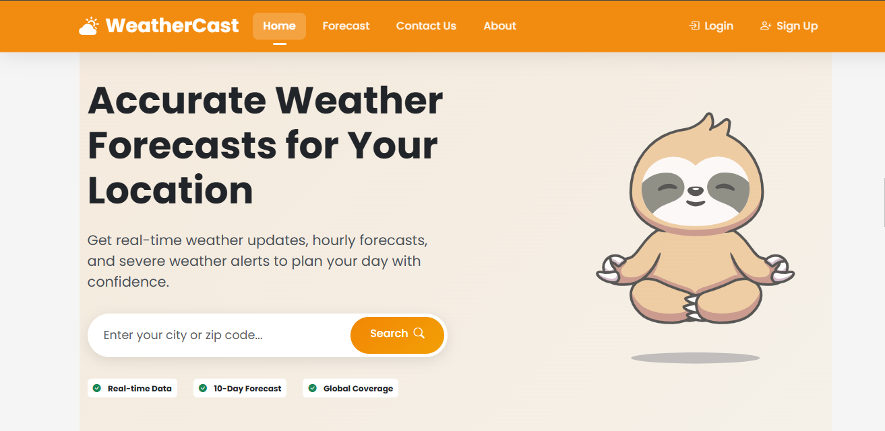
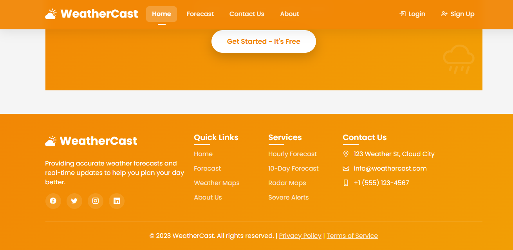
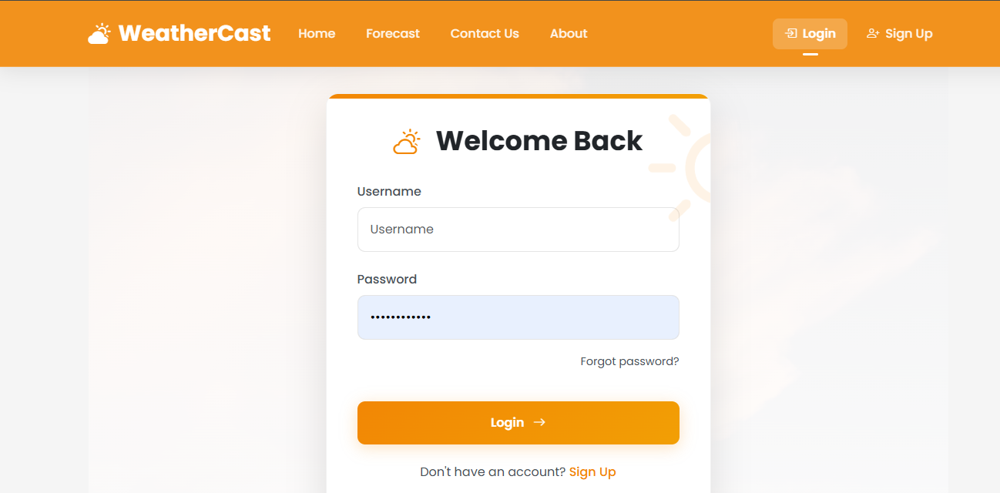
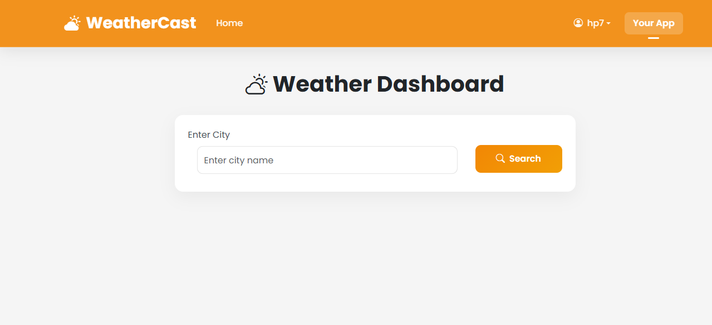
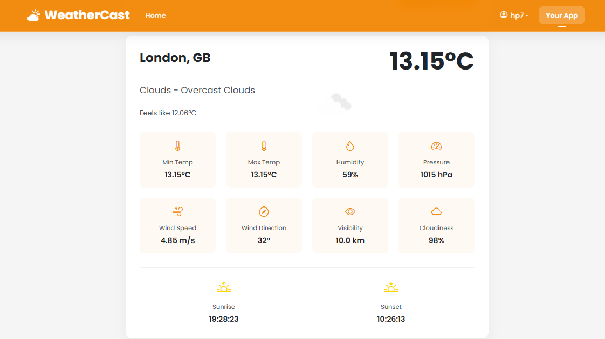

# WeatherCast 🌤️

A Django-powered weather application with user authentication and real-time weather data.


## Features

### 🔐 User Authentication
- User registration and login
- Protected weather search
- Session management

### 🌦️ Weather Search
- Search by city name
- Current weather conditions
- Detailed meteorological data
- Responsive design

## Screenshots
|  |  |
|--------------------------------------|-----------------------------------------------|
| *User Home*                         | *New User Footer*                       |

|  |  |
|--------------------------------------|-----------------------------------------------|
| *User Login*                         | *New User Registration*                       |

|  |  |
|----------------------------------------|------------------------------------------|
| *City Search*                          | *Weather Results*                        |

## Tech Stack

**Backend:**
- Python 3.10+
- Django 4.2
- Django REST Framework (if applicable)

**Frontend:**
- Bootstrap 5
- HTMX (for dynamic updates)

**API:**
- OpenWeatherMap API

## Installation

1. Clone the repository:
   ```bash
   git clone https://github.com/DrLeroK/weather_app.git
   cd weather_app